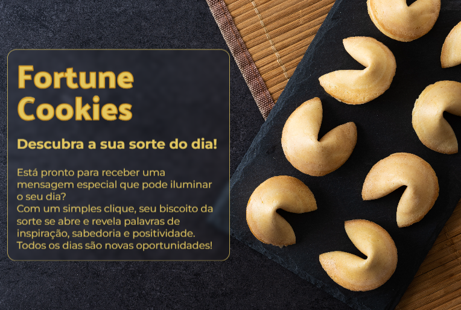

<h1 align="center"> Fortune Cookie App </h1>

Fortune cookie app, page that randomly generates a lucky phrase for the user with just one click

  <a href="#Technologies">Technologies</a>&nbsp;&nbsp;&nbsp;|&nbsp;&nbsp;&nbsp;
  <a href="#Project">Project</a>&nbsp;&nbsp;&nbsp;|&nbsp;&nbsp;&nbsp;
  <a href="#Link-to-view">Link to view</a>&nbsp;&nbsp;&nbsp;|&nbsp;&nbsp;&nbsp;
  <a href="#memo-license">License</a>

  

  
<h1 align="center">
  
</h1>

<h1 align="center">
  
</h1>

  
<h2 align="left" id="Technologies"> &nbsp;&nbsp; Technologies </h2>

This project was developed with the following technologies:
- [HTML]
- [CSS]
- [JavaScript]
- [Git and Github]

  
<h2 align="left" id="Project"> &nbsp;&nbsp; Project </h2>

  - With just one click, the application generates a lucky phrase for the user  
  - Layout with attractive and fun animations  
  - Responsive design, better user experience  
  - Project developed during the Full-stack Training course via the platform [Rocketseat](https://app.rocketseat.com.br)  

    
<h2 align="left" id="Link-to-view"> &nbsp;&nbsp;   Link to view </h2>

[Fortune Cookie](https://lucasfernandesm.github.io/Fortune-Cookie-App/)

  
## :memo: License

This project is under the MIT license.

---
